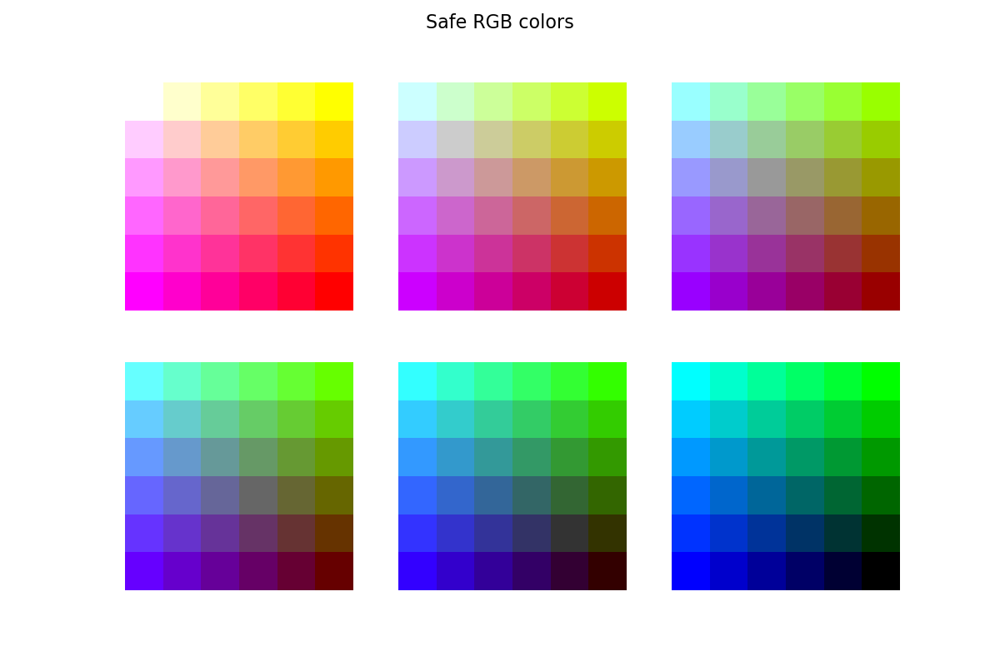

# Color Spaces

## Safe RGB colors

Plot the sections of the RGB cube space containing the safe colors.

## HSI <-> RGB
Implementation of `hsi2rgb` and `rgb2hsi`. Additional function to validate the conversion (`validate_conversion`).

## Triangular and circular HSI cross-sections
Plot circular and triangular cross-sections for a given list of intensity (I) values. 
